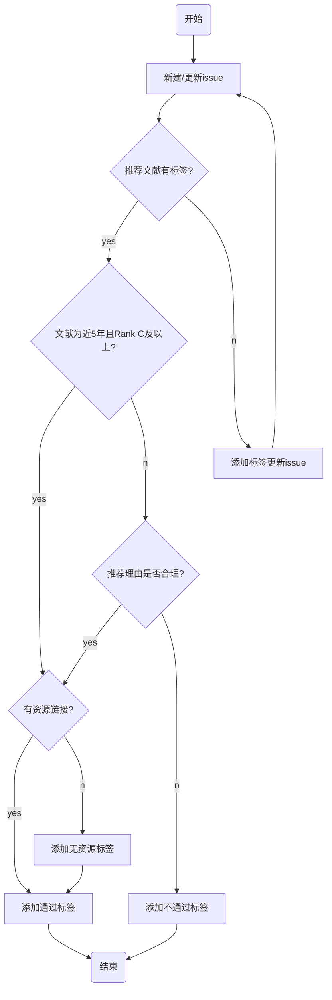

# 论文收集流程图

```mermaid
flowchart TD
	start(开始)
    op1[新建/更新issue]
    cond_a{推荐文献有标签?}
    cond_b{文献为近5年且Rank C及以上?}
    cond_c{有资源链接?}
		cond_d{推荐理由是否合理?}
		
    op3[添加通过标签]
    op4[添加不通过标签]
    exit(结束)
    op_1no[添加标签更新issue]
    op_cno[添加无资源标签]


    start --> op1 --> cond_a --yes--> cond_b --yes--> cond_c --yes--> op3 --> exit
    
    cond_a --no-->op_1no --> op1
    cond_b --no-->cond_d --yes-->cond_c
    cond_d --no-->op4 -->exit
    cond_c --no-->op_cno-->op3
    
    
   
```